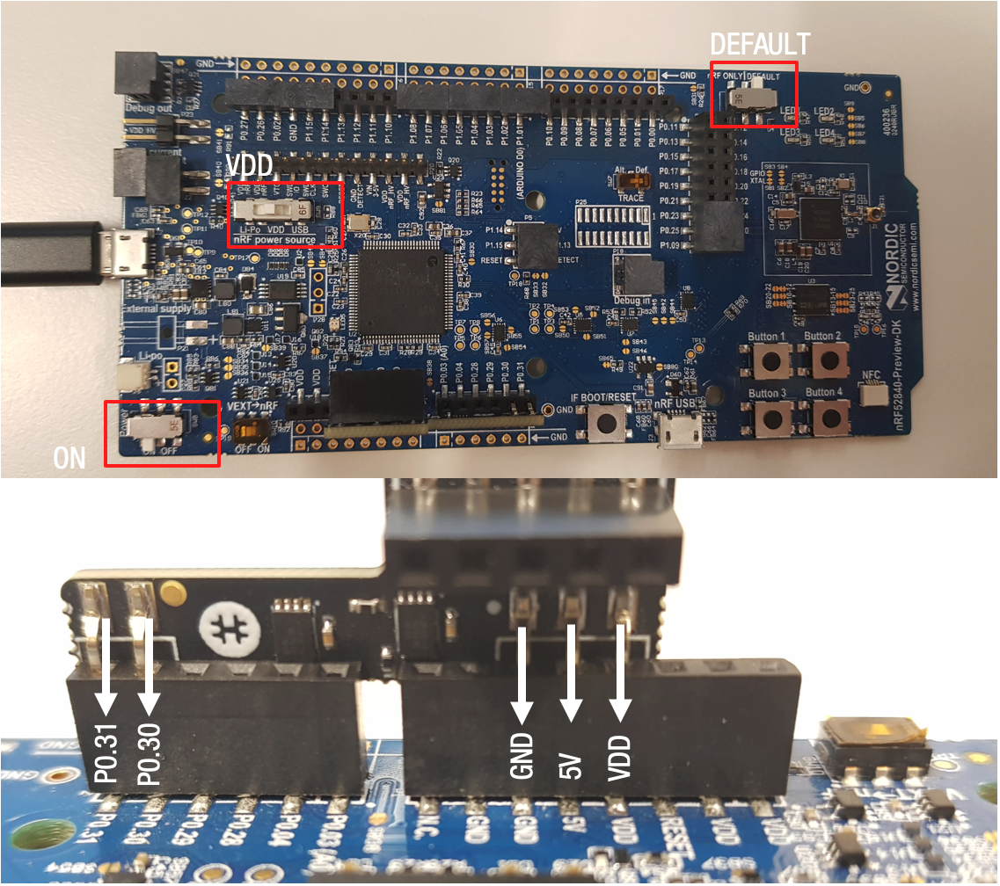

# IoT Community SDK

This is a sample repository to demonstrate the RIDDLE&CODE Secure Element Community edition and the trezor crypto library with the Nordic Semiconductor nRF52 DK.
The goal of this sample code is to show how to easily set up bitcoin key creation and maintenance on an embedded device.

A step-by-step guideline will guide through the set up process for the board and the Arduino IDE. 
Thereafter, a short sample shows what can be achieved on that very board easily.

## Connecting the Secure Element 2.0 to the NRF:

## Set up the board

1. Download and install the Arduino IDE (At least v1.6.12)
2. Start the Arduino IDE
3. Go into Preferences
4. Add https://sandeepmistry.github.io/arduino-nRF5/package_nRF5_boards_index.json as an "Additional Board Manager URL"
5. Open the Boards Manager from the Tools -> Board menu and install "Nordic Semiconductor nRF5 Boards"
6. Select the nRF52 DK board from the Tools -> Board menu 
7. Set the programmer -> J-Link

Follow the other OS dependent instructions from https://github.com/sandeepmistry/arduino-nRF5 if your device hasn't been flashed before (Note: RIDDLE&CODE usually ships already flashed devices but you might still need to install/replace the driver via Zadig: https://github.com/sandeepmistry/arduino-nRF5#driver-setup-for-segger-j-link).

## Compile and run the software

After having installed and compiled the software the provided sample ./wallet/wallet.ino can be compiled and ensure that the library files of the project got placed into your arduino library path.

1. Compile the wallet project
2. Upload the wallet project to your device
3. Connect the serial port and see your results (e.g. a BTC address)

## Questions

Please send emails to support@riddleandcode.com in case of questions or suggestions.

